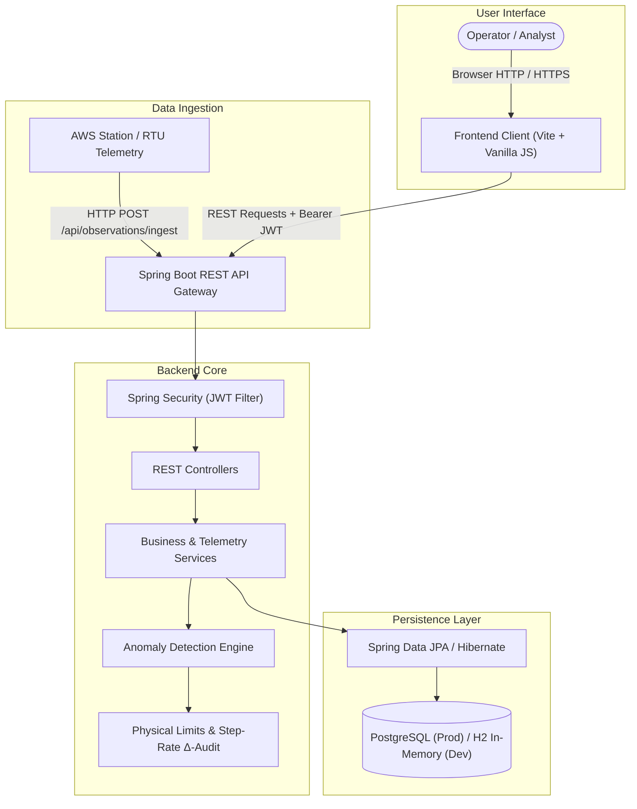

# Aerisence

Aerisence is an operational meteorological verification and telemetry quality control platform for Automatic Weather Station (AWS) networks. It ingests high-frequency terrestrial observations, enforces World Meteorological Organization (WMO-No. 8) physical constraints, and flags sensor anomalies in real time.

---

## Key Features

- **Physical Meteorological Verification**: Evaluates inbound atmospheric telemetry against thermodynamic plausibility bounds, temporal rate-of-change limits, and zero-variance flatline detection.
- **Automated Anomaly Classification**: Identifies and categorizes sensor faults (`OUT_OF_BOUNDS`, `SPIKE`, `STEP_CHANGE`, `PERSISTENCE_FLATLINE`) with calculated confidence scores and diagnostic hypotheses.
- **Station & Sensor Management**: Tracks operational state (`ONLINE`, `DEGRADED`, `OFFLINE`), hardware metadata, calibration dates, battery levels, and sensor health scores across distributed station arrays.
- **Interactive Atmospheric Visualizations**: Renders real-time 3D spatial network meshes, global atmospheric projections with Three.js, and multi-parameter telemetry trend charts using Chart.js.
- **Incident & Alert Lifecycle**: Dispatches prioritized alerts on critical anomaly detection and enables operational acknowledgement, status transitions, and audit-logged incident triage.
- **Role-Based Governance**: Secures administrative, analytical, and operational workflows with stateless JWT authentication and 4 granular user roles (`ADMIN`, `OPERATOR`, `ANALYST`, `VIEWER`).

---

## System Architecture



- **Client Layer**: SPA built with ES Modules, Tailwind CSS, Three.js, and Chart.js served through Vite. Communicates with the backend exclusively via JSON REST endpoints.
- **API Gateway & Security**: Spring Boot 3.3.4 exposes REST endpoints secured with Spring Security filters and stateless JSON Web Tokens (JJWT).
- **Quality Control Engine**: Core Java services execute inline deterministic validation on every received telemetry frame before persisting data.
- **Persistence Layer**: Spring Data JPA manages relational entities and transaction boundaries over PostgreSQL in production or an in-memory H2 database for local development.

---

## Data Flow

```mermaid
flowchart LR
    Source["AWS Transducer / Fixture"] -->|Raw Telemetry Frame| Ingest["Ingestion Endpoint"]
    Ingest -->|Plausibility & Rate Checks| AnomalyDetection["Detection Engine"]
    AnomalyDetection -->|Quality Flagged Observation| DBStore[("Database Store")]
    DBStore -->|Query & Aggregations| RestAPI["REST API"]
    RestAPI -->|JSON Payload| UIViews["UI Dashboard & 3D Mesh"]
    UIViews -->|Rendered Diagnostics| EndUser["Operator / Analyst"]
```



1. **Ingestion**: Remote AWS nodes or simulated transmitters send JSON payloads (`temperature`, `atmosphericPressure`, `relativeHumidity`, `batteryLevel`) to `POST /api/observations/ingest`.
2. **Quality Control**: Inbound values are compared against physical limits (`-50°C to 60°C`, `870 to 1085 hPa`, `0% to 100%`), temporal rate deltas against the preceding observation, and rolling persistence buffers.
3. **Persistence & Alerting**: Observations are assigned quality flags (`VALID`, `SUSPICIOUS`, `ANOMALOUS`). Anomalies spawn corresponding alert records in the database.
4. **Presentation**: The frontend queries REST endpoints with Bearer authentication and renders live status badges, telemetry graphs, and 3D geospatial node projections for the user.

---

## Technology Stack

| Layer | Technology | Purpose |
|---|---|---|
| **Frontend** | Vanilla JavaScript (ES Modules), HTML5 | Dynamic single-page application and route management |
| **Styling** | Tailwind CSS 3.4 | Utility-first responsive dark-mode styling and UI tokens |
| **3D Graphics** | Three.js 0.168 | Interactive 3D atmospheric globe and sensor network mesh |
| **Data Viz** | Chart.js 4.4 | Telemetry time-series charts and parameter distribution histograms |
| **Build Tool** | Vite 5.4 | Frontend development server, bundling, and asset optimization |
| **Backend** | Java 17, Spring Boot 3.3.4 | REST API services, ingestion gateway, and security filters |
| **Security** | Spring Security, JJWT 0.12.6 | Stateless JWT generation, verification, and role-based access control |
| **ORM / Data** | Spring Data JPA, Hibernate | Relational entity mapping, querying, and transaction control |
| **Database** | H2 (Dev) / PostgreSQL (Prod) | In-memory development data store and production persistence |
| **Deployment** | Vercel (`vercel.json`) | Frontend static distribution and rewrite routing configuration |

---

## Why These Technologies

- **Vanilla JS + Three.js + Vite**: Eliminates heavy framework runtime overhead while providing direct DOM access and WebGL performance for real-time 3D telemetry rendering.
- **Spring Boot 3 + Java 17**: Delivers enterprise-grade concurrency, strong type safety, and robust validation pipelines essential for critical meteorological data ingestion.
- **Spring Security + JJWT**: Provides stateless token authentication with zero server-side session overhead, allowing straightforward horizontal scaling.
- **Dual H2 / PostgreSQL Profile**: H2 enables zero-dependency, instant local setup with auto-seeded test fixtures, while PostgreSQL provides ACID compliance and indexed time-series queries for production.

---

## Project Structure

```text
Aerisence/
├── Backend/
│   ├── src/main/java/com/aerisence/
│   │   ├── config/           # CORS, Security, and Database Fixture Seeder
│   │   ├── controller/       # REST Endpoints (Auth, Stations, Anomalies, etc.)
│   │   ├── dto/              # Request/Response Data Transfer Objects
│   │   ├── entity/           # JPA Entities (Station, Observation, Anomaly, Alert)
│   │   ├── repository/       # Spring Data JPA Repositories
│   │   ├── security/         # JWT Token Provider, Filters, and Auth Details
│   │   └── service/          # Anomaly Detection Engine & Business Services
│   ├── src/main/resources/   # application.yml, application-dev/prod.yml
│   └── pom.xml               # Maven dependencies and build configuration
├── Frontend/
│   ├── src/
│   │   ├── components/       # Reusable UI elements (Navbar, Sidebar, Modal, Toast)
│   │   ├── scenes/           # Three.js 3D scenes (Globe, SensorMesh, Pipeline)
│   │   ├── services/         # REST client (api.js), Auth manager, Chart helpers
│   │   ├── views/            # 17 View Controllers (Dashboard, Stations, Anomalies, etc.)
│   │   ├── router.js         # Client-side hash/path routing engine
│   │   └── main.js           # Application entrypoint
│   ├── package.json          # Frontend dependencies and Vite scripts
│   └── vite.config.js        # Vite build and proxy settings
├── Docs/                     # Technical specifications (API, Architecture, DB, Setup)
├── .env.example              # Environment variables template
├── LICENSE                   # MIT License
├── package.json              # Monorepo proxy scripts
└── vercel.json               # Frontend deployment configuration
```

---

## Setup

### Prerequisites
- **Java**: JDK 17 or 21
- **Node.js**: Node 18+ and npm

### 1. Run Backend (Spring Boot)
```bash
cd Backend
# Windows PowerShell
.\mvnw.ps1 spring-boot:run

# Linux / macOS
./mvnw spring-boot:run
```
- API Base URL: `http://localhost:8080/api`
- H2 Console: `http://localhost:8080/h2-console` (JDBC URL: `jdbc:h2:mem:aerisencedb`, User: `sa`, Password: empty)

### 2. Run Frontend (Vite)
```bash
cd Frontend
npm install
npm run dev
```
- Frontend Application: `http://localhost:5173`

### 3. Test Credentials (Auto-Seeded)
| Role | Username | Password |
|---|---|---|
| Admin | `admin` | `Admin@Aerisence2026!` |
| Operator | `operator` | `Operator@Aerisence2026!` |
| Analyst | `analyst` | `Analyst@Aerisence2026!` |
| Viewer | `viewer` | `Viewer@Aerisence2026!` |

---

## Data Sources

- **Ingestion Telemetry**: Accepts structured observation payloads via `POST /api/observations/ingest` from remote AWS station loggers and RTUs.
- **Seeded Development Fixtures**: `DataInitializer.java` auto-populates the database on startup with 6 geographically diverse weather stations (Alps, Pacific Coast, Central Plains, Mojave Desert, Taiga, Metro Core), 18 calibrated sensors, 24-hour historical telemetry series, and sample anomaly scenarios.
- **Client Fallback Dataset**: `Frontend/src/services/api.js` includes offline fallback fixture sets to enable standalone frontend development and preview without an active backend.

---

## Authentication & Security

- **Stateless JWT**: Authentication issues signed HMAC-SHA256 tokens valid for 24 hours. The token is passed via standard `Authorization: Bearer <token>` headers.
- **Password Hashing**: Passwords stored using BCrypt cryptographic hashing with salts.
- **Role-Based Access Control**: Spring Security method and endpoint security restrict operations across four roles (`ROLE_ADMIN`, `ROLE_OPERATOR`, `ROLE_ANALYST`, `ROLE_VIEWER`).
- **Audit Logging**: Sensitive actions and authentication attempts are recorded in an internal immutable audit repository.

---

## Limitations & Future Scope

### Current Limitations
- Anomaly detection uses rule-based physical limit thresholds rather than dynamic multivariate ML models.
- Telemetry ingestion is HTTP REST-based; WebSocket push endpoints are prepared in config but real-time telemetry is currently polled or on-demand.
- External weather agency integrations (e.g., NOAA, ECMWF, METAR APIs) are not integrated out-of-the-box.

### Future Scope
- Integration of auto-regressive Machine Learning models (e.g., LSTM / Isolation Forests) for predictive drift forecasting.
- Native MQTT / CoAP broker support for direct low-power IoT telemetry streaming.
- Automated sensor cross-validation using spatial kriging against neighbouring geographical stations.
- Webhook notification dispatchers for PagerDuty, Slack, and email incident routing.

---

## License

This project is licensed under the [MIT License](LICENSE). Copyright &copy; 2026 Aerisence Systems Inc.

---

## Project Status

**Functional Prototype / Pre-Production**: Full end-to-end telemetry ingestion, quality control bounds checking, database persistence, JWT authentication, and interactive 3D frontend views are fully implemented and verified.
